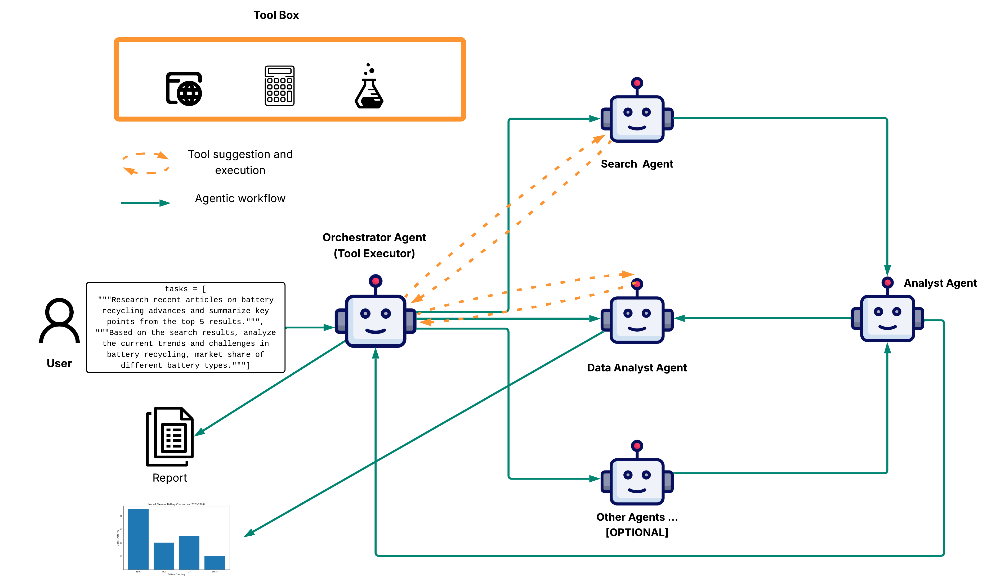

# AutoGen DeepResearch

This project demonstrates a multi-agent research system using AutoGen with Cerebras AI. It coordinates specialized agents to perform web research, analyze information, and create data visualizations.

## Project Structure

- `main.py`: Entry point that orchestrates the multi-agent conversation
- `config.py`: Configuration file containing agent system messages and LLM settings
- `util.py`: Utility functions for web search and data visualization
- `requirements.txt`: Project dependencies

## Agents

1. **Orchestrator**: Manages the team of expert agents and coordinates their efforts
2. **SearchAgent**: Performs web searches using the Tavily API
3. **AnalystAgent**: Analyzes and synthesizes information from search results
4. **DataAnalystAgent**: Analyzes data and creates visualizations using matplotlib

## Data Visualization

The DataAnalystAgent can create various types of plots:
- Bar charts
- Line plots
- Scatter plots
- Pie charts

## Workflow




## Setup

1. Install dependencies:
   ```
   pip install -r requirements.txt
   ```

2. Set up environment variables in `.env`:
   - `CEREBRAS_API_KEY`: Your Cerebras API key
   - `TAVILY_API_KEY`: Your Tavily API key (for web search)

## Usage

Run the main script:
```
python main.py
```
